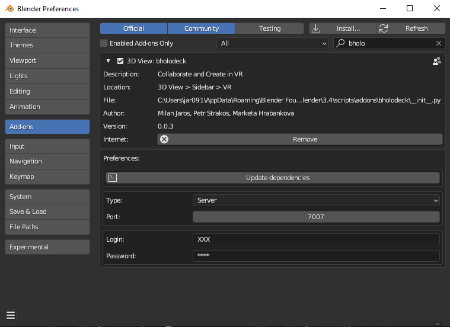
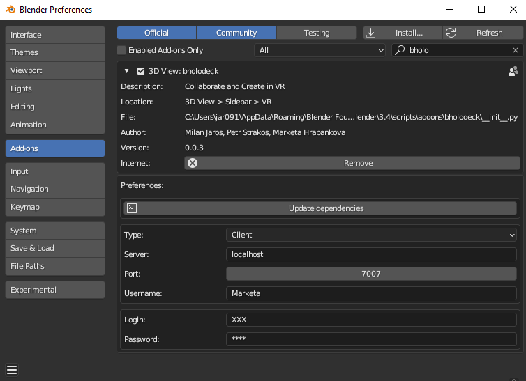
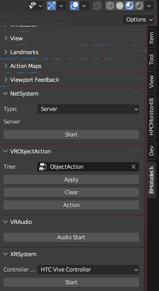
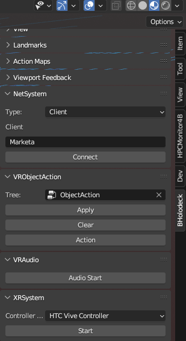
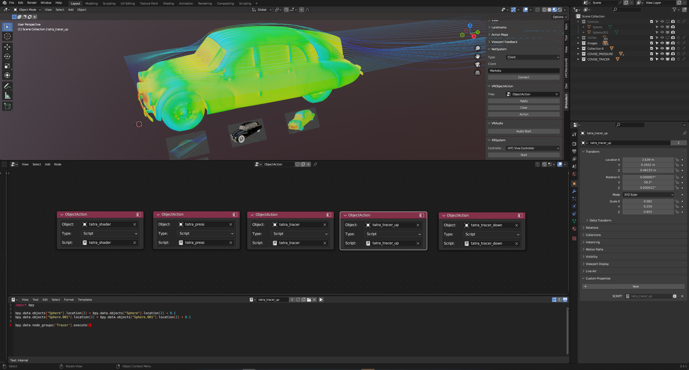

# BHolodeck
BHolodeck (VR Holodeck for Blender) is a multi-user scene inspection tool based on VR Scene Inspection. The tool consists of two parts: a client and a server. The server can run on a remote computer directly in the Blender environment. Each client sends actions to other clients and each client can see that action directly in the VR environment. Communication between the client and the server is done using gRPC (a high-performance framework for remote procedure calls).

### Addon Description
*Addon preferences*. To communicate with the server, you need to set the username and the password. 

*3DViewport menu*. The menu can be found in the sidebar of the 3D viewport in the BHolodeck section.

*The object action nodes*. To specify actions in a VR environment, there is an object node tree, where you can map scripts/actions to individual objects in the scene. An action can be invoked by using the controller button and pointing to a given object in the scene.

*The example of multi-user inspection*.

### Addon Installation
Install the add-on (addons/bholodeck) using Blender preferences and set the server, the username and the password. Install/Update dependencies (the button in Blender preferences).

## Acknowledgement
This work was supported by the Ministry of Education, Youth and Sports of the Czech Republic through the e-INFRA CZ (ID:90254).

This work was supported by the Doctoral grant competition VSB-Technical University of Ostrava, reg. no. CZ.02.2.69/0.0/0.0/19_073/0016945 within the Operational Programme Research, Development and Education, under project DGS/TEAM/2020-008 "Development of a tool for scientific data processing and visualization in VR with multi-user support".